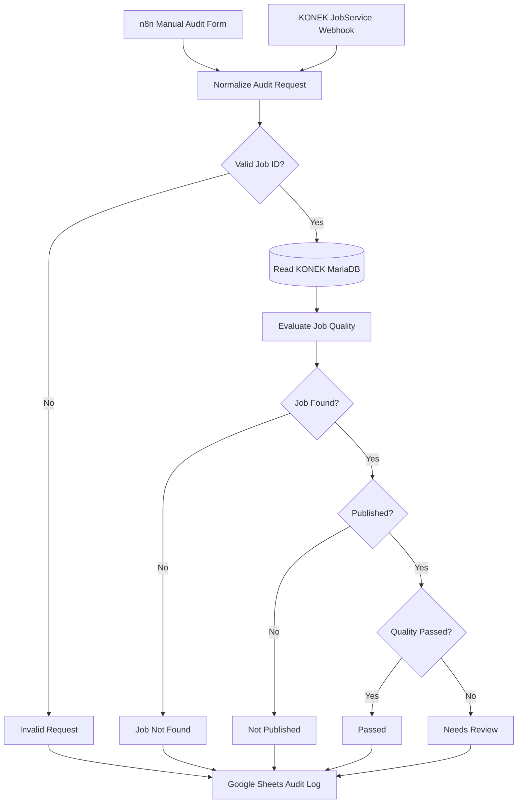

# KONEK Job Quality Audit

This n8n workflow is integrated with the KONEK student marketplace.

It accepts a KONEK job ID through the required n8n Form Trigger or receives a
job-created webhook from Laravel. It then reads the real KONEK job from
MariaDB, evaluates listing quality, routes the result, and appends an
operational audit record to Google Sheets.

## Why this architecture

- The Form Trigger explicitly satisfies the challenge.
- The Laravel webhook makes the automation part of KONEK's real job lifecycle.
- The native MySQL node uses a read-only account against KONEK's existing
  `jobs`, `users`, and `categories` tables.
- Laravel remains the only system allowed to mutate marketplace state.
- The Code node applies deterministic, explainable quality checks.
- Google Sheets gives administrators a convenient audit queue without becoming
  a second source of truth.

Follow [`docs/MANUAL-SETUP.md`](docs/MANUAL-SETUP.md) to configure the
read-only database account, webhook authentication, Google OAuth, test cases,
and Loom recording.

